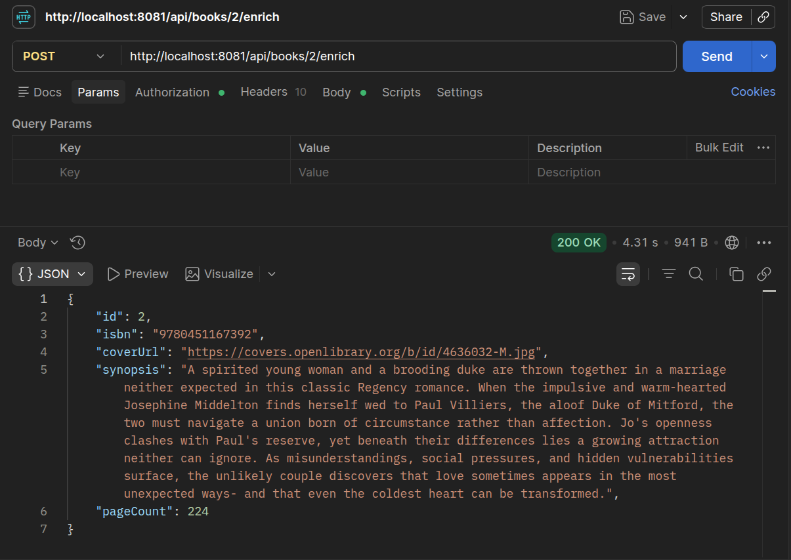
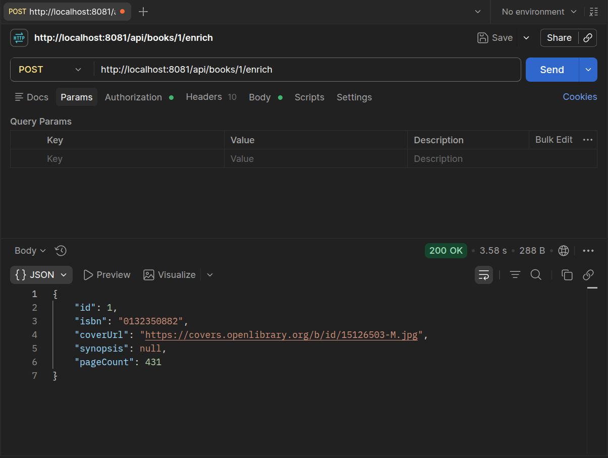
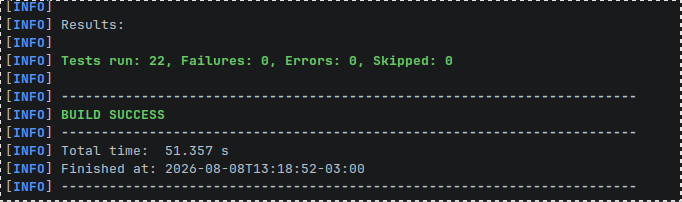
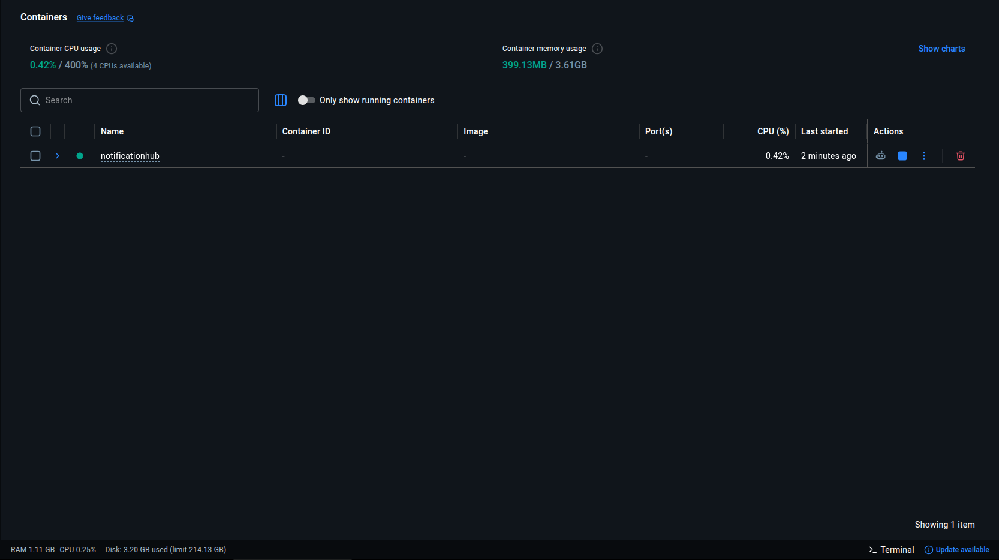

# notification-hub

<p align="center">
  
</p>

<h1 align="center">Notification Hub</h1>

<p align="center">
  
  
  
  
</p>

<p align="center">
  <strong>Serviço satélite do <a href="https://github.com/Andrey479/librarymanager">Library Manager</a> que consome a API pública da Open Library para enriquecer dados de livros e mantém o status de empréstimos consistente via job agendado — construído com foco em resiliência a falhas de API externa e testado com WireMock.</strong>
</p>

---

### 🔍 Visão Geral

O **Library Manager** é um sistema fechado: expõe dados, mas nunca consome APIs externas. O **Notification Hub** fecha essa lacuna. É um serviço satélite que:

- Consulta a **Open Library API** por ISBN e enriquece livros com capa, sinopse e número de páginas — sem sobrescrever dados já existentes;
- Roda um **job diário agendado** (`@Scheduled`) que identifica empréstimos vencidos e atualiza o status para `OVERDUE`;
- É **containerizado** com Docker multi-stage e orquestrado via `docker-compose`;
- Trata falhas da API externa com **fallback gracioso**: indisponibilidade da Open Library nunca resulta em erro 500 para o cliente.

---

### 📸 Prova Visual

#### 1. Enriquecimento via Open Library — cenário de sucesso



Requisição `POST /api/books/{id}/enrich` retornando capa, sinopse e número de páginas. Este cenário exercita o `DescriptionDeserializer` customizado, que normaliza os dois formatos que a Open Library retorna para o campo `description` (string simples ou objeto `{type, value}`).

#### 2. Fallback gracioso — Open Library indisponível



Mesmo com a Open Library fora do ar (ou sem dados para o ISBN), a resposta continua **200 OK** — o livro é retornado com os campos de enriquecimento como `null`, nunca com erro 500. Essa é a decisão arquitetural central do projeto (ver ADR-003).

#### 3. Suíte de testes



22 testes cobrindo unidade (Mockito), integração (WireMock + `@SpringBootTest`) e o job agendado — incluindo os três cenários de falha da API externa (404, timeout, JSON malformado).

#### 4. Ambiente containerizado



Ambiente completo (aplicação + PostgreSQL) sobe com um único comando: `docker compose up --build`.

---

### 🧠 Decisões Técnicas e Trade-offs

Documentação completa em [`docs/decisions.md`](docs/decisions.md), no formato ADR (Architecture Decision Record). Resumo das decisões mais relevantes para entrevista técnica:

- **RestClient em vez de WebClient:** o projeto não tem requisito de alta concorrência — o enriquecimento é disparado por chamada individual, não em lote paralelo. `RestClient` (síncrono, Spring 6.1+) é mais simples de configurar, testar e ler. Trocaria por `WebClient` se precisasse de programação reativa ou chamadas paralelas não-bloqueantes.

- **Banco de dados compartilhado com o Library Manager:** os dois serviços apontam para o mesmo PostgreSQL. O Notification Hub roda com `ddl-auto=validate` — nunca cria ou altera schema, apenas valida que a estrutura esperada já existe; só o Library Manager, dono do schema, roda com `ddl-auto=update`. Em produção real isso seria um anti-pattern de microsserviços (acopla os dois serviços via schema); foi uma decisão consciente de escopo para portfólio júnior, com o ownership dos dados ainda expresso em código — `Book.isbn` tem `@Column(insertable = false, updatable = false)` no Notification Hub, porque quem escreve esse campo é o Library Manager.

- **Fallback gracioso, nunca 500 para falha de terceiro:** `OpenLibraryClient` diferencia três cenários — ISBN não encontrado (`Optional.empty()`), timeout/erro de rede (relançado para a camada de serviço decidir) e resposta malformada (`Optional.empty()` + log de warning). Indisponibilidade de uma API que não controlamos nunca deveria derrubar a experiência do próprio serviço.

- **Tratamento de exceções em três camadas:** `ResourceNotFoundException` (404) e `BusinessException` (422) cobrem erros esperados com mensagens específicas; um `@ExceptionHandler(Exception.class)` genérico captura o inesperado, loga o stack trace completo no servidor (`log.error`) e retorna uma mensagem fixa e genérica ao cliente — nunca `ex.getMessage()` no corpo da resposta, para evitar vazamento de detalhes internos de implementação (CWE-209, information disclosure).

- **Deserializer customizado para inconsistência de API externa:** o campo `description` da Open Library varia de formato entre registros (string simples ou objeto `{type, value}`). Um `ValueDeserializer<String>` customizado normaliza os dois casos, testado com ambos os formatos reais da API.

---

### 🐳 Como Rodar Localmente

**Pré-requisitos:** Docker e Docker Compose.

```bash
cp .env.example .env
# edite o .env com uma senha de banco de sua escolha
docker compose up --build
```

A API estará disponível em `http://localhost:8081`. Endpoint principal:

```
POST /api/books/{id}/enrich
```

---

### 🔗 Projeto Complementar

Este serviço consome dados do [**Library Manager**](https://github.com/Andrey479/librarymanager) — API REST completa com TDD, JWT e regras de negócio de empréstimos, também disponível no meu portfólio.

---

### 👨‍💻 Autor

**Andrey Oliveira**
Desenvolvedor Java/Spring Boot em transição para a primeira vaga na área.

[](https://www.linkedin.com/in/andrey-oliveira-software)
[](https://github.com/Andrey479)

---
*Este projeto foi licenciado sob a [GNU Affero General Public License v3.0](LICENSE).*